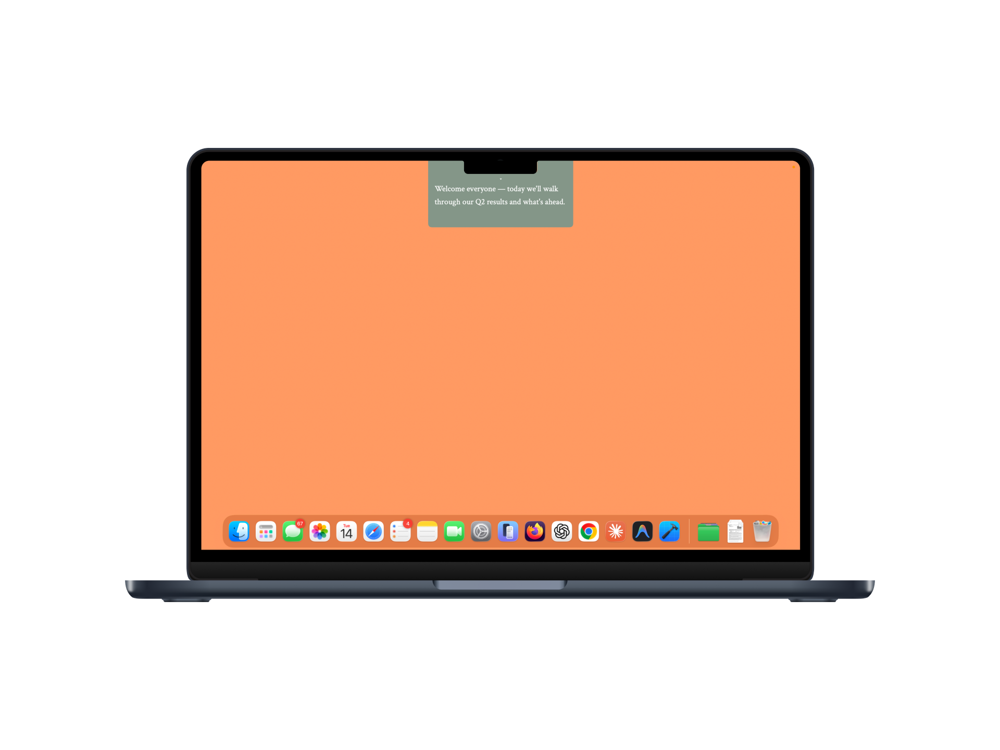
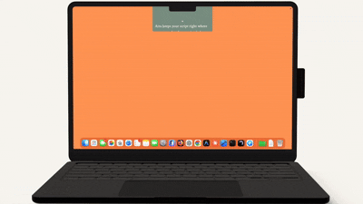
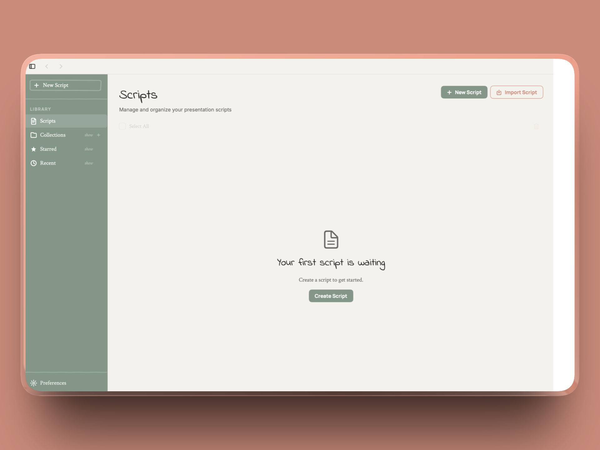
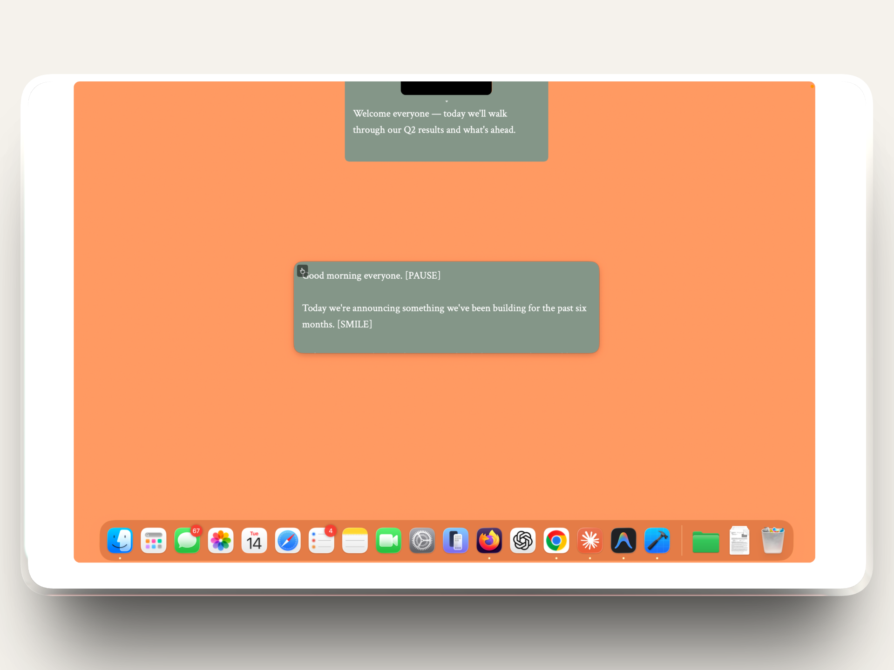
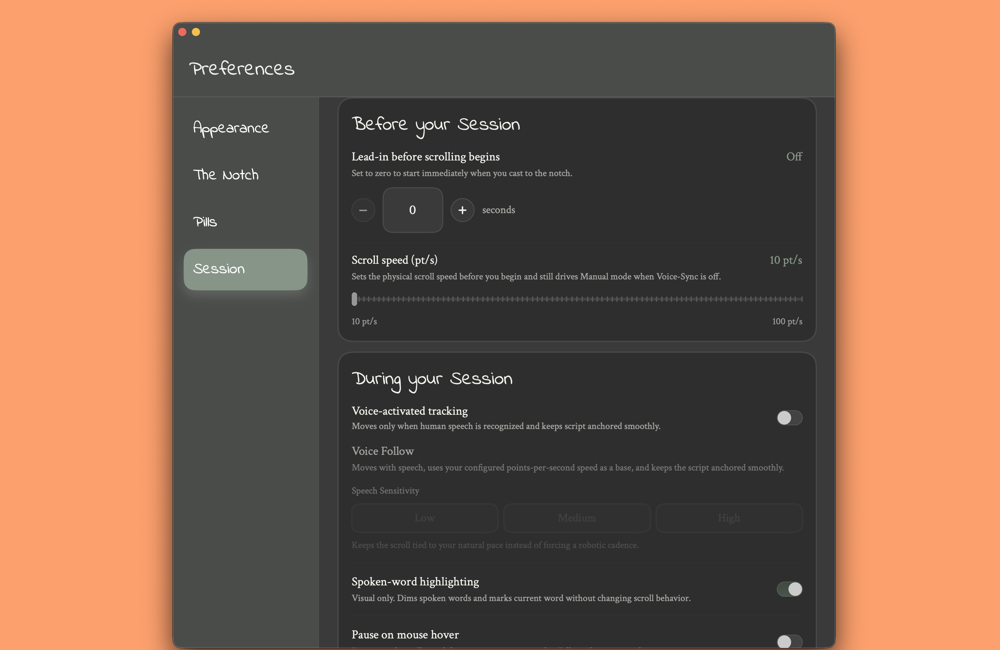
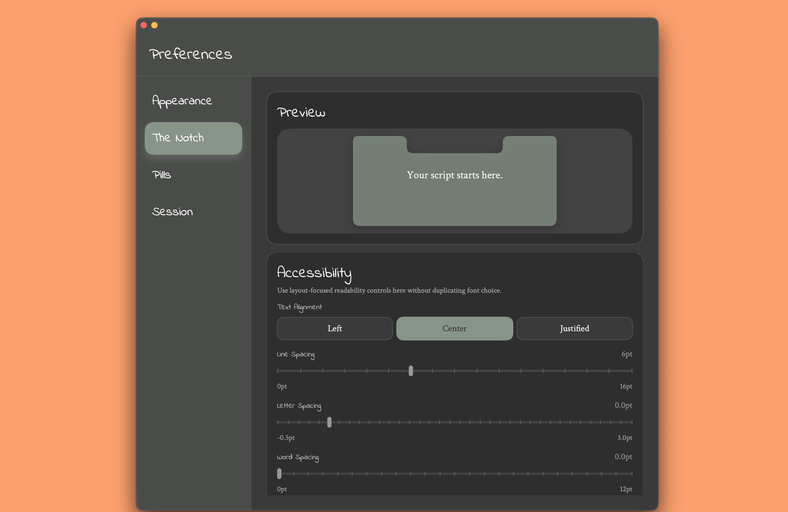
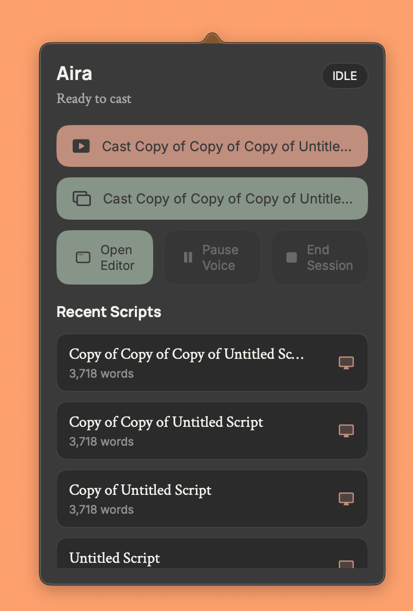

# Aira

Voice-synced teleprompter for macOS.

Aira is a native macOS teleprompter built for presenters, podcasters, lecturers, interview prep, and video creators who want to stay on script without looking off-screen. It keeps your script in a floating overlay near the camera, supports voice-aware scrolling, and stays local-first.

## Why Aira

Most teleprompters feel like generic text panes. Aira is designed for live speaking on macOS:

- **Voice-aware scrolling** that tracks your pace instead of forcing you to chase a preset speed
- **Notch and pill overlays** that stay accessible while you present
- **Collections and fast script organization** for real workflows, not one-off documents
- **Local-first storage** with no account, no cloud dependency, and no telemetry-first product design
- **Presentation-focused controls** like pause, hover controls, keyboard shortcuts, and screen-share-aware overlay behavior

### Product Walkthrough

## What It Does

### Scripts that fit actual session flow

- Create, edit, duplicate, star, and delete scripts quickly
- Organize scripts into collections
- Add scripts to collections in three ways:
  - hover action
  - drag and drop
  - context menu
- Create new collections inline as you organize

### Flexible overlays for different setups

- Use the notch overlay for camera-adjacent delivery
- Use pill overlays when you want movable floating script surfaces
- Undock the notch when it is the only overlay active
- Redock smoothly when you want to return to the notch
- Use fullscreen on supported external-display contexts

### Voice-aware session controls

- Voice-activated tracking with adjustable sensitivity
- Word highlighting as a visual reading aid
- Pause on mouse hover
- Quick pause, mute, close, swap, and fullscreen actions on hover
- Keyboard shortcuts grouped under controls

### Accessibility and readability tuning

- Adjustable font
- Letter spacing
- Line spacing
- Word spacing
- Text shadow
- Text padding
- Clamped size controls so settings stay usable instead of drifting into nonsense values

### Menu bar and quick access

- Fast access from the menu bar
- Menu bar icon adapts between black and white variants based on the menu bar appearance
- Easier dismissal behavior for the menu bar window

## Feature Highlights

### Overlay system

- Notch overlay
- Pill overlays
- Undock and redock flow
- Fullscreen support where it makes sense
- Hover action buttons replacing older context-menu-heavy interactions

### Library and organization

- Collections
- Multi-entry collection management
- Drag-to-collection workflow
- Hover add-to-collection flow
- Context menu actions for duplicate, star, collection membership, and delete

### Session settings

- Before your session grouping
- During your session grouping
- Controls grouping
- Privacy grouping
- Countdown timer
- Stable scroll speed using points per second instead of WPM-derived math
- Word highlighting
- Pause on mouse hover toggle
- Screen sharing visibility toggle for overlays

### Accessibility

- Readability adjustments for script presentation
- Font selection
- Better preview accuracy for notch-related settings
- Safer value ranges for width, height, and font size

## Privacy

Aira is built to be local-first.

- Your scripts stay on your Mac
- No account required
- No collaboration layer
- No cloud sync requirement
- No telemetry-first onboarding flow

Speech and microphone access are used for voice-sync features. Accessibility access is used for the overlay and control behaviors that require macOS permissioned APIs.

## Download

Public downloads and beta releases should live in the release repository.

- Releases: `https://github.com/sankirthk/aira-releases/releases`
- Website: `https://github.com/sankirthk/aira-site`

Once your public repo exists, update this section with:

- direct website URL
- latest beta download link
- App Store link when live

## Roadmap

Current focus:

- public beta polish
- App Store submission
- better onboarding for first-session permissions
- richer public docs and release visuals

Planned improvements:

- more polished screenshots and demo videos
- public issue triage
- clearer compatibility guidance by macOS version and hardware setup

## Feedback

If something breaks, feels off, or blocks your setup, open an issue.

- Bug reports: use the bug template
- Feature ideas: use the feature request template
- Device/setup-specific problems: use the compatibility report template

## Repository Structure

This public repo is intended to contain:

- public-facing README and documentation
- screenshots, GIFs, and short demo videos
- issue tracking
- release/distribution links

This repo should **not** contain the private shipping app source.

## License

Add the license you want for the public-facing repository here.
