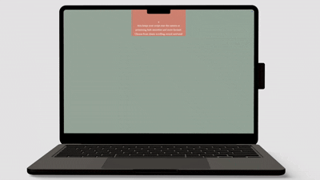
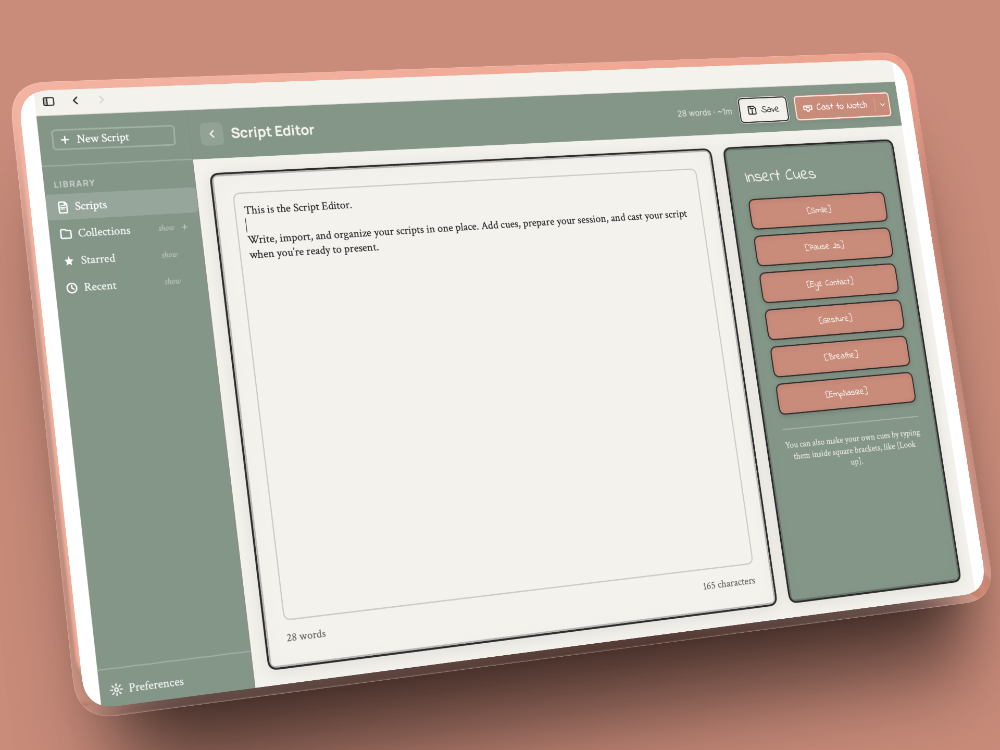
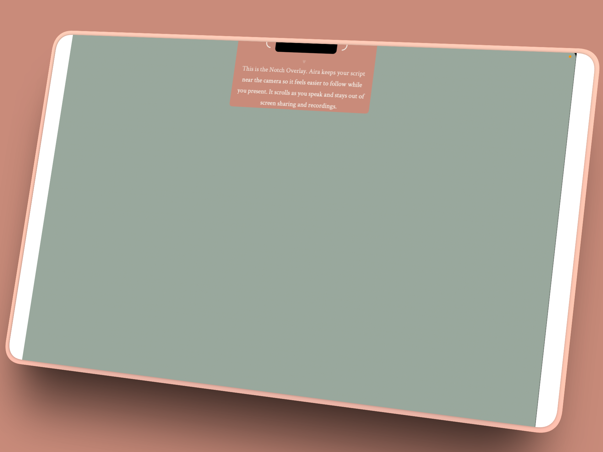
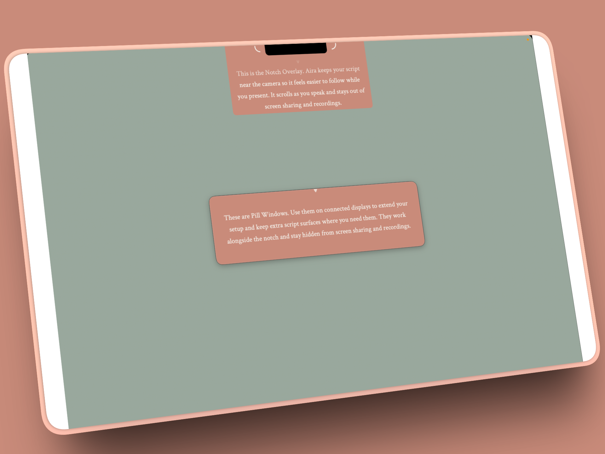
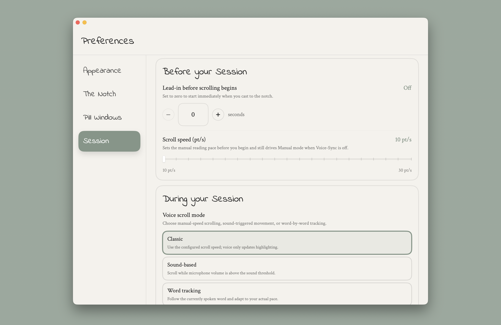
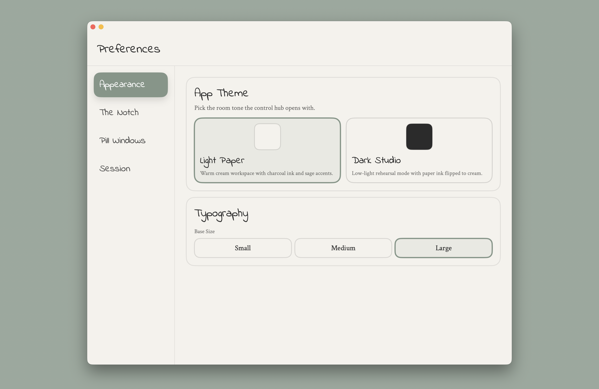
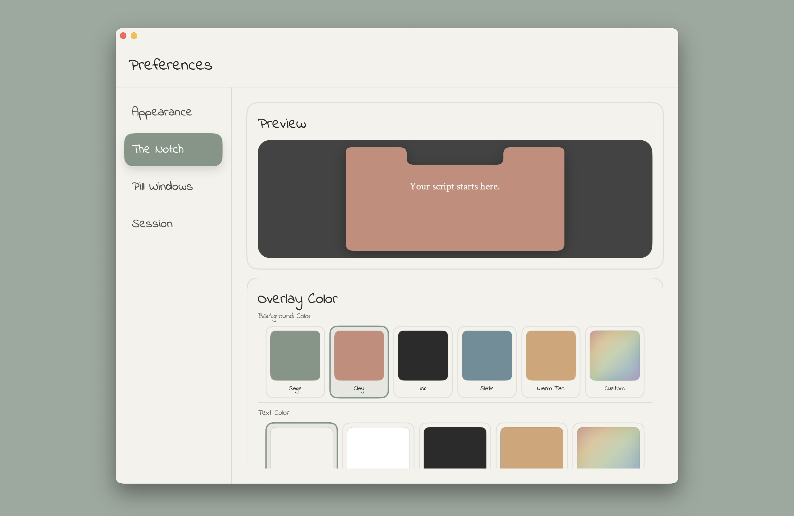
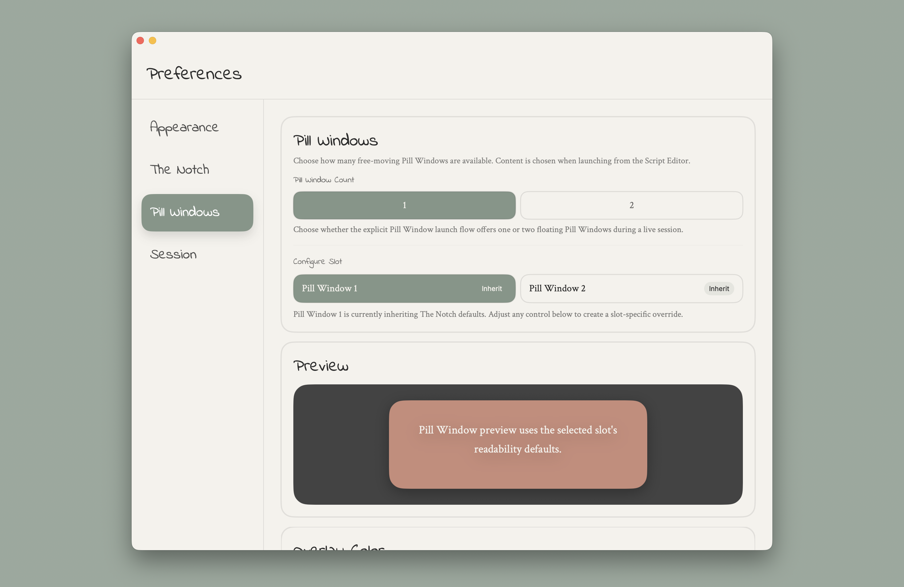
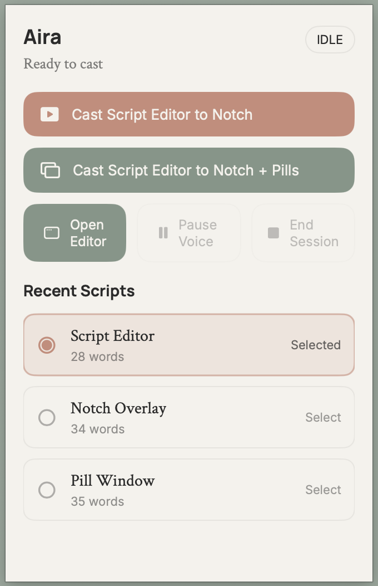

# Aira

Voice-synced teleprompter for macOS.

Download here: https://useaira.co

Aira is a native macOS teleprompter built for presenters, podcasters, lecturers, interview prep, and video creators who want to stay on script without looking off-screen. It keeps your script in a floating overlay near the camera, supports voice-aware scrolling, and stays fully local — no account, no cloud, no internet required.

## Why Aira

Most teleprompters feel like generic text panes. Aira is designed for live speaking on macOS:

- **Offline voice-aware scrolling** powered by on-device WhisperKit models — tracks your spoken words instead of forcing you to chase a preset speed, with no cloud speech processing
- **Notch and pill overlays** that stay accessible while you present without cluttering your screen
- **Collections and fast script organization** for real workflows, not one-off documents
- **Local-first storage** with no account, no cloud dependency, and no telemetry-first product design
- **Presentation-focused controls** like pause, hover controls, keyboard shortcuts, and screen-share-aware overlay behavior

### Demo

## What It Does

### Script library and editor

- Create, edit, duplicate, star, and delete scripts quickly
- Organize scripts into collections
- Add scripts to collections three ways: hover action, drag and drop, or context menu
- Create new collections inline as you organize
- Empty scripts are blocked from launching so you never open a blank session by accident

### Notch overlay

- Sits near the camera for natural eye contact
- Wraps around the built-in MacBook notch
- Excluded from screen-share capture so remote participants never see the prompter
- Undock and redock smoothly depending on your setup
- Optional fullscreen support for compatible external-display contexts

### Pill windows

- Movable floating overlays for setups where the notch is not available or preferred
- Choose how many pill windows to open at launch time — no pre-configuring every session in Preferences
- Each pill window can mirror the current notch session or run a separately selected script
- Each pill window has its own appearance and readability settings while inheriting sensible defaults when untouched

### Offline Word Matching Sync

- Aira bundles WhisperKit models for fully on-device word-based script tracking
- No runtime model download, no cloud speech processing, no internet required
- The script scroll position follows your spoken words in real time
- Word highlighting locks on quickly at the start of a script and recovers when you skip ahead to a later visible phrase
- Sound activated scrolling uses local microphone levels as an alternative motion mode
- Classic mode scrolls manually unless word highlighting is enabled

### Session controls and script progress

- Voice-activated tracking with adjustable sensitivity
- Word highlighting as a visual reading aid during delivery
- Optional thin progress indicator at the bottom edge of the overlay so you can see where you are in the script at a glance
- Real microphone mute — the mic button pauses and resumes audio capture, not just scroll movement
- Separate pause/resume button for Classic mode when word highlighting is enabled
- Pause on mouse hover
- Quick pause, mute, close, swap, and fullscreen actions on overlay hover
- Keyboard shortcuts grouped under controls
- Countdown timer before session starts

### Appearance and readability

- Adjustable font
- Letter spacing, line spacing, and word spacing
- Text shadow and text padding
- Background and text color presets with custom color picker support
- Clamped size controls so settings stay usable instead of drifting into nonsense values
- Settings changes update active overlays live without requiring a new session

### Notch settings

- Control notch overlay width, height, and position
- Adjust font and readability for the notch window specifically

### Pill window settings

- Enable pill windows and set how many (one or two)
- Pill window count control is disabled when pill windows are off

### Menu bar and quick access

- Fast access from the menu bar without switching windows
- Menu bar icon adapts between black and white variants based on menu bar appearance
- Menu bar launches respect the selected voice mode

## Feature Highlights

### Overlay system

- Notch overlay excluded from screen-share capture
- Pill windows with launch-time content assignment
- Mirrored pill window mode (follows the notch session)
- Manual pill window mode (independently assigned script)
- Undock and redock flow
- Fullscreen support where it makes sense

### Word Matching Sync

- Fully offline, powered by bundled WhisperKit models
- On-device word highlighting with fast startup acquisition
- Phrase recovery so speaking later visible text can move the highlight anchor after a skipped section
- Three scroll modes: Word Matching Sync, Sound activated scrolling, Classic
- Word highlighting available across all three modes

### Library and organization

- Collections with multi-entry management
- Drag-to-collection and hover add-to-collection workflows
- Context menu actions for duplicate, star, collection membership, and delete
- Empty-script launch guard

### Session settings

- Before session / During session groupings
- Scroll speed using points per second for stable, consistent motion
- Word highlighting with phrase recovery
- Real microphone mute
- Script progress indicator
- Pause on mouse hover toggle
- Screen sharing visibility toggle for overlays

### Accessibility

- Readability adjustments for script presentation
- Font selection
- Clamped value ranges for width, height, and font size
- Live settings updates to active overlay windows

## Privacy

Aira is built to be local-first.

- Your scripts stay on your Mac
- No account required
- No collaboration layer
- No cloud sync requirement
- No telemetry-first onboarding flow
- Word Matching Sync uses bundled on-device speech models — no audio leaves your device

Speech and microphone access are used for voice-sync features. Accessibility access is used for overlay and control behaviors that require macOS permissioned APIs.

## Download

- Releases: [github.com/sankirthk/aira-releases/releases](https://github.com/sankirthk/aira-releases/releases)
- Website: [github.com/sankirthk/aira-site](https://github.com/sankirthk/aira-site)

## Roadmap

Current focus:

- App Store submission
- Better onboarding for first-session permissions
- Richer public docs and release visuals
- Public beta polish based on Word Matching Sync feedback

Planned improvements:

- More polished demo videos
- Public issue triage
- Clearer compatibility guidance by macOS version and hardware setup

## Feedback

If something breaks, feels off, or blocks your setup, open an issue.

- Read [How to report a bug](docs/report-a-bug.md) before filing a bug so your report includes the exact setup, permissions, and reproduction steps that matter for Aira.
- Read [How to request a feature](docs/request-a-feature.md) before submitting ideas so requests stay concrete, scoped, and tied to real workflows.
- Bug reports: use the bug template
- Feature ideas: use the feature request template
- Device/setup-specific problems: use the compatibility report template
- Open the issue chooser here: [New issue](https://github.com/sankirthk/AiraPublic/issues/new/choose)

## Repository Structure

This public repo contains:

- Public-facing README and documentation
- Screenshots and demo visuals
- Issue tracking
- Release and distribution links

This repo does **not** contain the private shipping app source.

## License

This repository is proprietary. See the [LICENSE](LICENSE) file for details.
